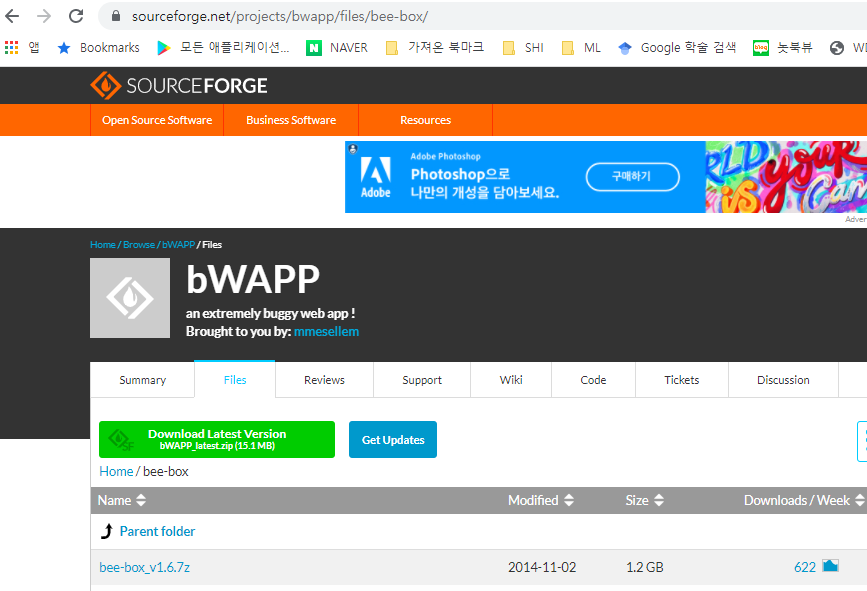
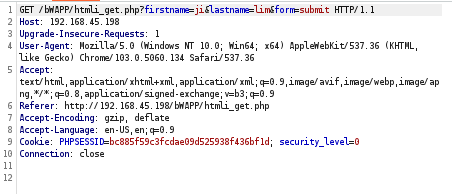
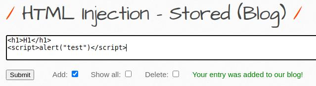
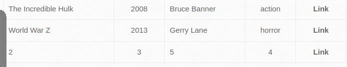
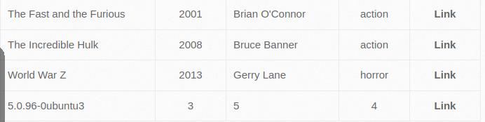
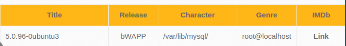
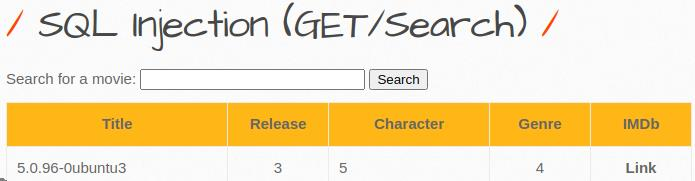

# web-security-lab

> 웹 취약점 분석 실습 — bWAPP 기반 HTML Injection · XSS · SQL Injection 공격 시나리오 및 방어 방법

의도적으로 취약하게 설계된 웹 애플리케이션 bWAPP을 VirtualBox 환경에서 구축하고, 실제 공격 시나리오를 통해 웹 취약점의 동작 원리와 방어 방법을 학습한 실습 기록입니다.

---

## 사용 기술

- VirtualBox (bee-box 가상 머신)
- bWAPP (Buggy Web Application)
- Burp Suite (Kali Linux)
- HTML Injection / XSS / SQL Injection / Server Side Includes

---

## 실습 환경

| 구성 | 내용 |
|------|------|
| 취약 앱 | bWAPP (bee-box VM) |
| 공격 도구 | Burp Suite (Kali Linux) |
| 네트워크 | VirtualBox 브릿지 어댑터 |
| 계정 | bee / bug |

---

## 실습 항목

### 1. 환경 구성



bee-box VM을 VirtualBox에 등록하고 브릿지 어댑터로 네트워크를 구성했습니다. Burp Suite 프록시를 통해 요청을 가로채는 환경을 세팅했습니다.

---

### 2. HTML Injection — Reflected GET



**Low**: `<h1>H1</h1>` 입력 → 태그 그대로 렌더링 확인

**XSS — 경고창 실행**
```html
<script>alert("test")</script>
```

**쿠키 탈취 시나리오**
```html
<script>alert(document.cookie)</script>
```
세션 쿠키 노출 확인 — 실제 공격 시 외부 서버로 쿠키를 전송해 세션 하이재킹 가능

**Medium — URL 인코딩 우회**
```
%3Ch1%3ESuccess%3C%2Fh1%3E
```

**High** — 인코딩까지 서버에서 처리해 공격 차단됨

---

### 3. HTML Injection — Stored Blog



```html
<script>alert("test")</script>
```
저장 시 다른 사용자 접속 때 자동 실행 — Reflected XSS 대비 피해 범위가 훨씬 넓음

---

### 4. SQL Injection (GET/Search)



**기본 — 조건 참으로 만들기**
```sql
'or'1'='1--
```
쿼리를 항상 참으로 만들어 전체 데이터 노출

**UNION SELECT 공격**



```sql
'union select 1,2,3,4,5,6,7#
```
컬럼 수 파악 후 UNION으로 임의 데이터 삽입

**DB 버전 추출**


```sql
0'union select all 1,@@version,3,4,5,6,7#
```

**DB 정보 추출**



```sql
0'union select all 1,@@version,database(),user(),@@datadir,6,7#
```
DB명, 현재 사용자, 데이터 디렉토리까지 한 번에 추출

**테이블 목록 추출**



```sql
0'union select all 1,table_name,3,4,5,6,7 from information_schema.tables#
```

---

### 5. Burp Suite 패킷 분석

- Intercept On으로 GET 요청 패킷 가로채기
- 요청/응답 헤더 구조 분석
- 파라미터 직접 수정 후 전송

---

## 배운 점

보안 수준(Low / Medium / High)에 따라 동일한 공격이 막히거나 통과되는 과정을 직접 보면서, 방어가 어느 레이어에서 어떻게 이루어지는지 체감했습니다.

`httpOnly` 쿠키 플래그가 JavaScript에서 `document.cookie` 접근을 막아 XSS 기반 세션 탈취를 차단한다는 원리를 실습으로 확인한 것이 인상 깊었습니다.

SQL Injection에서 `UNION SELECT`로 `information_schema`를 조회하면 DB 구조 전체가 노출된다는 것을 직접 실행해보면서, Prepared Statement가 왜 필수인지를 체감했습니다.

---

## 어려웠던 점

VirtualBox 네트워크 설정에서 공격 머신(Kali)과 대상 머신(bee-box)이 서로 통신하도록 브릿지 어댑터를 잡는 과정이 까다로웠습니다. IP 대역을 맞추는 데 시간이 많이 소요됐습니다.

Burp Suite의 Intercept 기능을 처음 사용할 때 인터셉트를 켠 채로 두면 브라우저가 멈추는 것처럼 보여서 혼란스러웠는데, 요청이 중간에서 대기 중인 상태라는 것을 이해하고 나서 흐름이 잡혔습니다.

---

## 현재 문제점

- **방어 코드 미구현**: 공격 시나리오만 실습했고, 실제 Node.js나 Spring Boot 코드에서 어떻게 방어하는지 직접 작성해보지 못했습니다.
- **자동화 공격 미실습**: sqlmap 같은 자동화 도구를 사용한 SQL Injection 자동화는 다루지 못했습니다.
- **환경 의존성**: VirtualBox + Kali + bee-box 구성이 복잡해 환경 재현이 어렵습니다. Docker로 구성했다면 훨씬 간편했을 것입니다.

## 고민해야 할 점

- **입력 검증의 위치**: 클라이언트(프론트엔드)에서 입력을 검증하는 것과 서버에서 검증하는 것의 차이가 뭘까요? 클라이언트 검증은 사용자 편의를 위한 것이고, 보안상 반드시 서버 측 검증이 필요합니다. Medium 레벨 우회를 보면서 클라이언트 필터링만으로는 충분하지 않다는 것을 직접 확인했습니다.
- **CSP 헤더의 적용 범위**: Content-Security-Policy 헤더로 허용된 출처의 스크립트만 실행하게 지정할 수 있는데, 실제 서비스에서 어떻게 설정하는지 더 공부하고 싶습니다.
- **Prepared Statement vs ORM**: SQL Injection을 막기 위해 Prepared Statement를 직접 쓰는 것과 Sequelize·JPA 같은 ORM이 내부적으로 파라미터 바인딩을 처리하는 것의 차이, ORM을 쓰면 SQL Injection이 완전히 차단되는지 확인이 필요합니다.

---

## 취약점별 방어 방법 정리

| 취약점 | 방어 |
|--------|------|
| Reflected XSS | 서버 측 입력값 이스케이프 (`htmlspecialchars`) |
| Stored XSS | DB 저장 전 sanitize, 출력 시 이스케이프 |
| 쿠키 탈취 | `httpOnly: true` 쿠키 플래그 설정 |
| 전반적 XSS | Content-Security-Policy(CSP) 헤더 설정 |
| SQL Injection | Prepared Statement / ORM 파라미터 바인딩 |
| SSI Injection | 서버에서 사용자 입력을 SSI로 처리하지 않도록 설정 |

---

## 추가로 공부해야 할 내용

- OWASP Top 10 전체 취약점 개요
- Prepared Statement와 ORM의 SQL Injection 방어 원리
- CSRF 공격과 CSRF Token 방어
- CSP(Content Security Policy) 헤더 설정
- 방어 코드 직접 작성 실습 (Node.js / Spring Boot)
